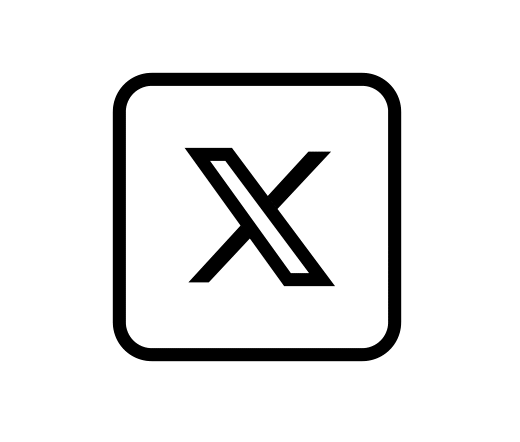

<div align="center">
  
</div>

<div></div>

Email Me 👉 ✉️ **arnab003jn.369@gmail.com** For Collaboration/Project or Anything Else. 😊😊


- 🚀 **What I’m Working On:** Programming, Web Development and Machine Learning
- 🌱 **I’m currently learning:** Data Structures & Algorithms (DSA), Machine Learning and Data Science Fundamentals
- 👯 **I’m looking to collaborate on:** Hackathons, Team Projects, and Open-source contributions
- 🤔 **I’m looking for help with:** Real-world project ideas, innovations and guidance
- 💬 **Ask me about:** Technology Trends, Learning Resources, or Getting Started in Tech
- 📫 **How to reach me:** arnab003jn.369@gmail.com
- 🔖 **Pronouns:** He/him

## 💡 I’m a dedicated learner with a passion for coding and continuous growth. Always eager to explore, build, and contribute. 😊
<p align="center">  
  
  
  
</p>


<!-- Snake Game Repo View -->

<div align="center">
  
</div>


-⚡ **Fun fact:** Do you know why Java Developers wear Specs? Because, they can't C!!
- **Help me Grow and Expand by Starring, Sharing and Forking my Repositories**


<h2>Brief about myself:</h2>
  <h3 align="center"><br>💻 I'm a passionate Computer Science graduate with a curious mind and a love for tech that just won't sit still.
From designing web interfaces to diving deep into data, I’m exploring the vast world of Web Development, mastering programming languages and technologies, and stepping into the fascinating realms of Machine Learning and Data Science.<br>
<br>I don't just write code — I solve puzzles, build things from scratch, and break them (gently 😄) just to see how they work. For me, every bug is a clue, every commit a milestone.</h3>


# 🌐 Socials:

 <!--🌐💬Social Media-->
<!-- 🌐💬 Social Media (GitHub-friendly inline styles) -->
<table align="center">
  <tr>
    <td>
      <a href="https://www.linkedin.com/in/arnabjana369/">
        
      </a>
    </td>
    <td>
      <a href="https://x.com/Arnab82998422?t=pe_LVizQdH6EUwbGQ57ATw&s=09">
        
      </a>
    </td>
    <td>
      <a href="https://discord.gg/.albertaj">
        
      </a>
    </td>
    <td>
      <a href="mailto:arnab003jn.369@gmail.com">
        
      </a>
    </td>
    <td>
      <a href="https://www.instagram.com/its_arnab_003">
        
      </a>
    </td>
    <td>
      <a href="https://in.pinterest.com/arnabj830/_profile/">
        
      </a>
    </td>
    <td>
      <a href="https://stackoverflow.com/users/23046205/arnab-jana">
        
      </a>
    </td>
    <td>
      <a href="https://www.quora.com/profile/Arnab-Jana-115">
        
      </a>
    </td>
    <td>
      <a href="https://www.reddit.com/u/MoodDisastrous64/s/nONniJYiI6">
        
      </a>
    </td>
  </tr>
</table>


# 💻 Technologies Used:
                                 


#  📊 GitHub Statistics:
<table align="center">
<tr border="none">
<td width="50%" align="center">
  
  <br/>
  
  <br><br>
  
  <br/>
  
</td>

<td width="50%" align="center">

  
  
  <br><br>
  
  

</td>
</tr>
</table>


## 🏆 GitHub Trophies


### ✍️ Favourite Quote:


## 📚 Top Contributed Repositories

<p align="left">
  
</p>

<div align="center">
  
</div>


---
[](https://visitcount.itsvg.in)

<!-- Proudly created with GPRM ( https://gprm.itsvg.in ) -->


📊 **This Week I Spent My Time On:**
<!--START_SECTION:waka-->


**🐱 My GitHub Data** 

> 📦 38.8 kB Used in GitHub's Storage 
 > 
> 🚫 Not Opted to Hire
 > 
> 📜 48 Public Repositories 
 > 
> 🔑 7 Private Repositories 
 > 
**I'm a Night 🦉** 

```text
🌞 Morning                64 commits          ███░░░░░░░░░░░░░░░░░░░░░░   13.73 % 
🌆 Daytime                134 commits         ███████░░░░░░░░░░░░░░░░░░   28.76 % 
🌃 Evening                266 commits         ██████████████░░░░░░░░░░░   57.08 % 
🌙 Night                  2 commits           ░░░░░░░░░░░░░░░░░░░░░░░░░   00.43 % 
```
📅 **I'm Most Productive on Sunday** 

```text
Monday                   67 commits          ████░░░░░░░░░░░░░░░░░░░░░   14.38 % 
Tuesday                  62 commits          ███░░░░░░░░░░░░░░░░░░░░░░   13.30 % 
Wednesday                64 commits          ███░░░░░░░░░░░░░░░░░░░░░░   13.73 % 
Thursday                 37 commits          ██░░░░░░░░░░░░░░░░░░░░░░░   07.94 % 
Friday                   55 commits          ███░░░░░░░░░░░░░░░░░░░░░░   11.80 % 
Saturday                 47 commits          ███░░░░░░░░░░░░░░░░░░░░░░   10.09 % 
Sunday                   134 commits         ███████░░░░░░░░░░░░░░░░░░   28.76 % 
```


📊 **This Week I Spent My Time On** 

```text
🕑︎ Time Zone: Asia/Kolkata

💬 Programming Languages: 
Other                    12 hrs 49 mins      ████████████████░░░░░░░░░   63.72 % 
JavaScript               3 hrs 13 mins       ████░░░░░░░░░░░░░░░░░░░░░   15.98 % 
Python                   2 hrs 49 mins       ████░░░░░░░░░░░░░░░░░░░░░   14.06 % 
Markdown                 48 mins             █░░░░░░░░░░░░░░░░░░░░░░░░   03.98 % 
JSON                     15 mins             ░░░░░░░░░░░░░░░░░░░░░░░░░   01.32 % 

🔥 Editors: 
Chrome                   17 hrs 9 mins       █████████████████████░░░░   85.24 % 
VS Code                  2 hrs 58 mins       ████░░░░░░░░░░░░░░░░░░░░░   14.76 % 

🐱‍💻 Projects: 
BACKEND_PROJECT          10 hrs 41 mins      █████████████░░░░░░░░░░░░   53.12 % 
DATA_SCIENCE_WITH_PYTHON_5 hrs 59 mins       ███████░░░░░░░░░░░░░░░░░░   29.78 % 
Arnab00369               1 hr 23 mins        ██░░░░░░░░░░░░░░░░░░░░░░░   06.88 % 
91798                    1 hr 12 mins        █░░░░░░░░░░░░░░░░░░░░░░░░   05.96 % 
JAVA_PRACTICE            44 mins             █░░░░░░░░░░░░░░░░░░░░░░░░   03.68 % 

💻 Operating System: 
Windows                  20 hrs 8 mins       █████████████████████████   100.00 % 
```

**I Mostly Code in C** 

```text
C                        18 repos            ██████████████░░░░░░░░░░░   56.25 % 
JavaScript               5 repos             ████░░░░░░░░░░░░░░░░░░░░░   15.62 % 
HTML                     3 repos             ██░░░░░░░░░░░░░░░░░░░░░░░   09.38 % 
Python                   2 repos             ██░░░░░░░░░░░░░░░░░░░░░░░   06.25 % 
Java                     1 repo              █░░░░░░░░░░░░░░░░░░░░░░░░   03.12 % 
```


**Timeline**


 Last Updated on 06/08/2025 18:55:56 UTC
<!--END_SECTION:waka-->


  

## 📆 GitHub Contributions Calendar


## Full Year Calendar:


## Half Year Calendar:


