<h1 align="center"> 💫 Hi 👋, I'm Arnab Jana</h1>
<h3 align="center">🎓 A curious mind on a coding journey💡 Tech enthusiast</h3>

Email Me 👉 ✉️ **arnab003jn.369@gmail.com** For Collaboration/Project or Anything Else. 😊😊


- 🚀 **What I’m Working On:** Programming, Web Development and Machine Learning
- 🌱 **I’m currently learning:** Data Structures & Algorithms (DSA), Machine Learning and Data Science Fundamentals
- 👯 **I’m looking to collaborate on:** Hackathons, Team Projects, and Open-source contributions
- 🤔 **I’m looking for help with:** Real-world project ideas, innovations and guidance
- 💬 **Ask me about:** Technology Trends, Learning Resources, or Getting Started in Tech
- 📫 **How to reach me:** arnab003jn.369@gmail.com
- 🔖 **Pronouns:** He/him

## 💡 I’m a dedicated learner with a passion for coding and continuous growth. Always eager to explore, build, and contribute. 😊
[](https://visitcount.itsvg.in)
<p align="left">  </p>

<!-- Snake Game Repo View -->

<div align="center">
  
</div>


-⚡ **Fun fact:** Do you know why Java Developers wear Specs? Because, they can't C!!
- **Help me Grow and Expand by Starring, Sharing and Forking my Repositories**

<h2>Brief about myself:</h2>
  <h3 align="center"><br>💻 I'm a passionate Computer Science graduate with a curious mind and a love for tech that just won't sit still.
From designing web interfaces to diving deep into data, I’m exploring the vast world of Web Development, mastering programming languages and technologies, and stepping into the fascinating realms of Machine Learning and Data Science.<br>
<br>I don't just write code — I solve puzzles, build things from scratch, and break them (gently 😄) just to see how they work. For me, every bug is a clue, every commit a milestone.</h3>


## 🌐 Socials:
[](https://discord.gg/https://discord.gg/.albertaj) [](https://instagram.com/https://instagram.com/https://www.instagram.com/its_arnab_003) [](https://linkedin.com/in/https://www.linkedin.com/in/arnabjana369?utm_source=share&utm_campaign=share_via&utm_content=profile&utm_medium=android_app) [](https://pinterest.com/https://in.pinterest.com/arnabj830/_profile/) [](https://quora.com/profile/https://www.quora.com/profile/Arnab-Jana-115) [](https://reddit.com/user/https://reddit.com/user/https://www.reddit.com/u/MoodDisastrous64/s/nONniJYiI6) [](https://stackoverflow.com/users/https://stackoverflow.com/users/23046205/arnab-jana?tab=profile) [](https://x.com/https://x.com/Arnab82998422?t=pe_LVizQdH6EUwbGQ57ATw&s=09) [](mailto:arnab003jn.369@gmail.com)

# 💻 Technologies Used:
                                 
# 📊 GitHub Stats:
<br/>
<br/>


## 🏆 GitHub Trophies


### ✍️ Favourite Quote:


## 📚 Top Contributed Repositories

<p align="left">
  
</p>


---
[](https://visitcount.itsvg.in)

<!-- Proudly created with GPRM ( https://gprm.itsvg.in ) -->


📊 **This Week I Spent My Time On:**
<!--START_SECTION:waka-->


**🐱 My GitHub Data** 

> 📦 33.3 kB Used in GitHub's Storage 
 > 
> 🏆 189 Contributions in the Year 2025
 > 
> 🚫 Not Opted to Hire
 > 
> 📜 47 Public Repositories 
 > 
> 🔑 7 Private Repositories 
 > 
**I'm an Early 🐤** 

```text
🌞 Morning                45 commits          █████░░░░░░░░░░░░░░░░░░░░   18.37 % 
🌆 Daytime                84 commits          █████████░░░░░░░░░░░░░░░░   34.29 % 
🌃 Evening                114 commits         ████████████░░░░░░░░░░░░░   46.53 % 
🌙 Night                  2 commits           ░░░░░░░░░░░░░░░░░░░░░░░░░   00.82 % 
```
📅 **I'm Most Productive on Sunday** 

```text
Monday                   65 commits          ███████░░░░░░░░░░░░░░░░░░   26.53 % 
Tuesday                  31 commits          ███░░░░░░░░░░░░░░░░░░░░░░   12.65 % 
Wednesday                29 commits          ███░░░░░░░░░░░░░░░░░░░░░░   11.84 % 
Thursday                 7 commits           █░░░░░░░░░░░░░░░░░░░░░░░░   02.86 % 
Friday                   10 commits          █░░░░░░░░░░░░░░░░░░░░░░░░   04.08 % 
Saturday                 34 commits          ███░░░░░░░░░░░░░░░░░░░░░░   13.88 % 
Sunday                   69 commits          ███████░░░░░░░░░░░░░░░░░░   28.16 % 
```


📊 **This Week I Spent My Time On** 

```text
🕑︎ Time Zone: Asia/Kolkata

💬 Programming Languages: 
Other                    10 hrs 54 mins      ██████████████████░░░░░░░   72.89 % 
Python                   2 hrs 18 mins       ████░░░░░░░░░░░░░░░░░░░░░   15.45 % 
JavaScript               54 mins             ██░░░░░░░░░░░░░░░░░░░░░░░   06.06 % 
JSON                     25 mins             █░░░░░░░░░░░░░░░░░░░░░░░░   02.80 % 
Text                     7 mins              ░░░░░░░░░░░░░░░░░░░░░░░░░   00.89 % 

🔥 Editors: 
Chrome                   11 hrs 41 mins      ████████████████████░░░░░   78.22 % 
VS Code                  3 hrs 15 mins       █████░░░░░░░░░░░░░░░░░░░░   21.78 % 

🐱‍💻 Projects: 
Arnab00369               4 hrs 56 mins       ████████░░░░░░░░░░░░░░░░░   32.99 % 
DATA_SCIENCE_WITH_PYTHON_3 hrs 12 mins       █████░░░░░░░░░░░░░░░░░░░░   21.41 % 
Mongoose_Practice        2 hrs 50 mins       █████░░░░░░░░░░░░░░░░░░░░   18.97 % 
BACKEND_PROJECT          1 hr 57 mins        ███░░░░░░░░░░░░░░░░░░░░░░   13.12 % 
DSA-Bootcamp-Java        1 hr 14 mins        ██░░░░░░░░░░░░░░░░░░░░░░░   08.26 % 

💻 Operating System: 
Windows                  14 hrs 57 mins      █████████████████████████   100.00 % 
```

**I Mostly Code in C** 

```text
C                        18 repos            ███████████████░░░░░░░░░░   58.06 % 
JavaScript               4 repos             ███░░░░░░░░░░░░░░░░░░░░░░   12.90 % 
HTML                     3 repos             ██░░░░░░░░░░░░░░░░░░░░░░░   09.68 % 
Python                   2 repos             ██░░░░░░░░░░░░░░░░░░░░░░░   06.45 % 
Java                     1 repo              █░░░░░░░░░░░░░░░░░░░░░░░░   03.23 % 
```


**Timeline**


 Last Updated on 23/07/2025 07:27:16 UTC
<!--END_SECTION:waka-->


## 📆 GitHub Contributions Calendar

## Full Year Calendar:




## Half Year Calendar:


